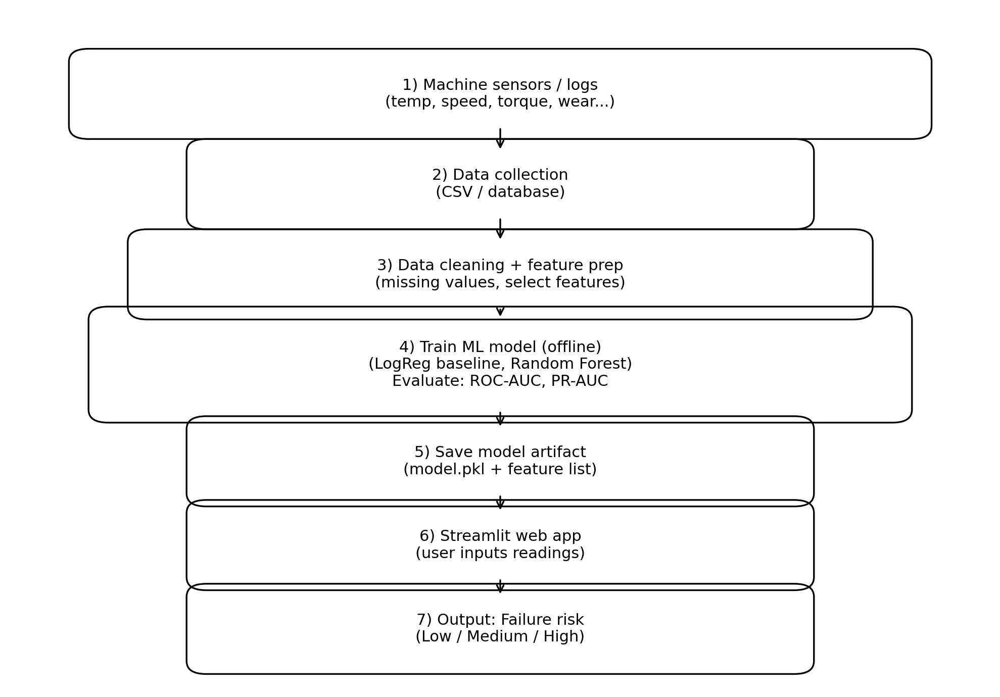

# 🚀 Predictive Maintenance Machine Learning Project

## 📌 Project Overview

This project builds an end-to-end **machine failure prediction system** using the **AI4I 2020 Predictive Maintenance dataset**.

The goal is to identify machines at high risk of failure **before breakdown occurs**, helping reduce downtime, maintenance cost, and operational risk.

This repository demonstrates a full professional machine learning workflow:

- Data exploration & preprocessing  
- Feature engineering  
- Handling imbalanced data  
- Model training (Logistic Regression + Random Forest)  
- Threshold tuning  
- Model evaluation using ROC-AUC, PR-AUC, confusion matrix  

---

## 🏗 System Architecture

---

## 📊 Dataset

**AI4I 2020 Predictive Maintenance Dataset**

Includes:

- Machine temperature  
- Air temperature  
- Rotational speed  
- Torque  
- Tool wear  
- Failure labels  

Target variable:

Machine Failure (0 = No failure, 1 = Failure)

---

## ⚙️ Technologies Used

- Python
- Pandas
- NumPy
- Scikit-learn
- Matplotlib / Seaborn
- Jupyter Notebook

---

## 🧠 Machine Learning Workflow

### 1️⃣ Data Preprocessing
- Removed unnecessary columns  
- Checked missing values  
- Scaled numeric features  
- Encoded categorical variables  

### 2️⃣ Handling Imbalanced Data
- Used **class weighting**
- Evaluated using precision-recall metrics

### 3️⃣ Models Implemented

- Logistic Regression (baseline)
- Random Forest (final model)

### 4️⃣ Model Evaluation

Metrics used:

- ROC-AUC
- Precision-Recall AUC
- Confusion Matrix
- Accuracy / Recall / Precision

---

## 📈 Results

- Random Forest achieved **very high predictive performance**
- Model successfully identifies high-risk machines before failure
- Demonstrates real-world industrial ML application

---

## ▶️ How to Run

### Clone repository

git clone https://github.com/habtamuadargaso/predictive-maintenance-ml.git
cd predictive-maintenance-ml

### Install dependencies

pip install -r requirements.txt

### Run notebook

Open:

Predictive_Maintenance_AI4I_2020.ipynb

---

## 📂 Project Structure

| File / Folder | Description |
|--------------|-------------|
| `Predictive_Maintenance_AI4I_2020.ipynb` | Main notebook containing data analysis, preprocessing, modeling, and evaluation |
| `images/` | Contains diagrams and visual assets used in the README |
| `images/predictive_maintenance_system_diagram.png` | System workflow illustration |
| `requirements.txt` | Python dependencies for reproducing the project |
| `.gitignore` | Files excluded from version control |
| `README.md` | Project documentation |

---

## 🎯 Business Impact

This type of model can be used in:

- Manufacturing plants
- Aviation maintenance
- Industrial IoT monitoring
- Predictive service scheduling
- Smart factory automation

It helps organizations:

✔ Prevent unexpected machine downtime  
✔ Reduce maintenance cost  
✔ Improve safety  
✔ Optimize operations  

---

## 👨‍💻 Author

**Habtamu Dargaso**

Data Scientist | Machine Learning Engineer  
Dual Master’s in Data Science & AI  

GitHub: https://github.com/habtamuadargaso  
LinkedIn: https://linkedin.com/in/habtamu-dargaso  

---

## ⭐ If you like this project

Please consider giving it a **star** ⭐  
